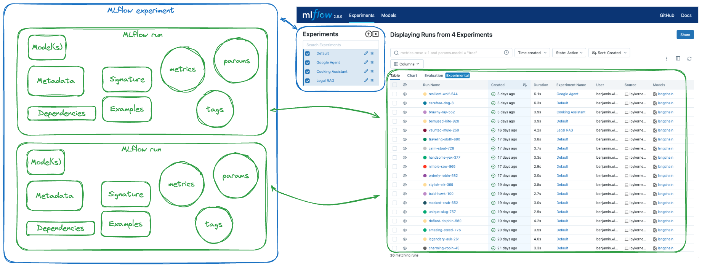
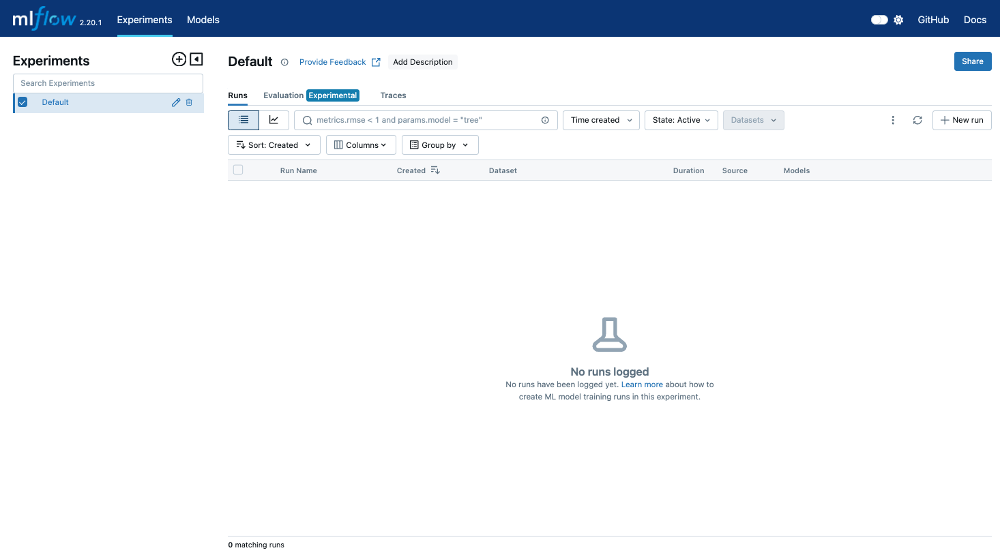
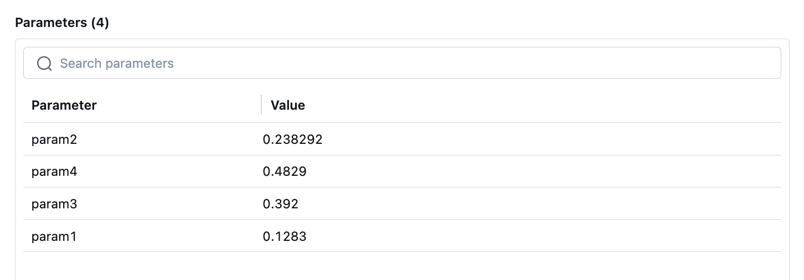
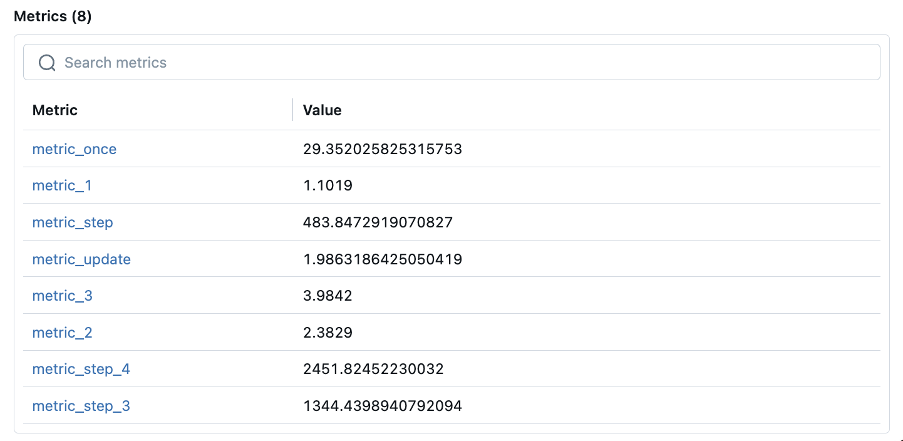
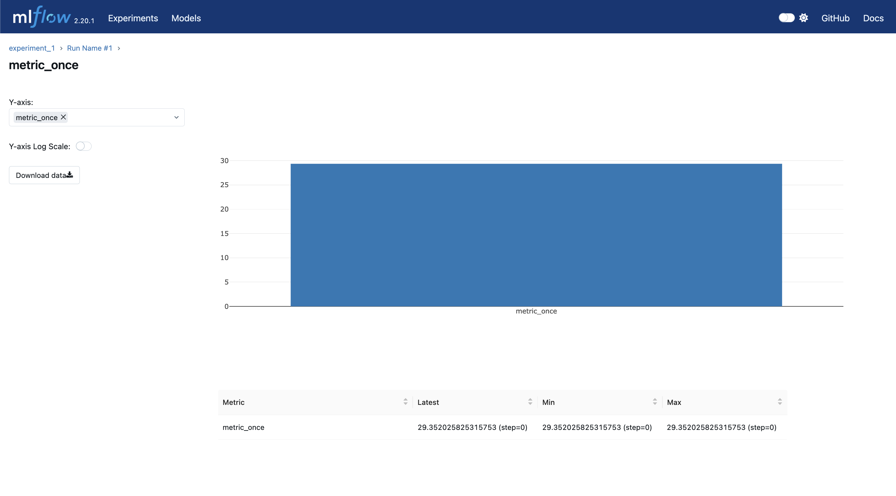
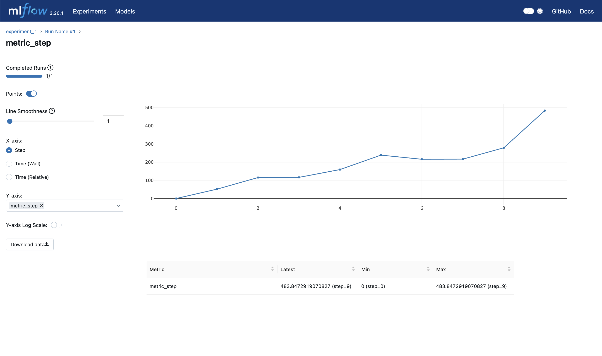
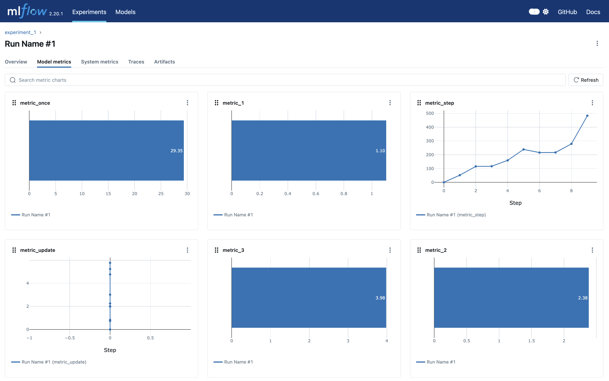
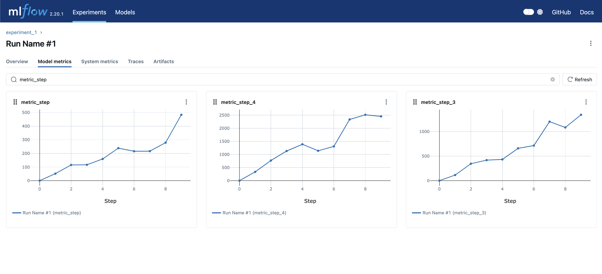

在我们使用Ray Tune的过程中，我们希望有一个开源且功能完备的实验追踪平台。
可以来帮助我们追踪训练过程中的调优的参数，以及每一个实验对应的最终指标结果等。

因此，我们尝试探索通过搭建本地的MLflow来进行相关的管理。

<!-- truncate -->

## MLflow的主要功能

MLflow提供了包含训练实验，模型注册管理部署等多种能力。

在本文中，我们主要会探索其训练记录相关的能力，用于配合Ray Tune寻找合适的强化学习训练参数。

## MLflow Tracking

如下图所示，MLflow中的架构主要包含如下概念：

- **Experiments**：所有的训练跟踪，都是在一个或多个实验中来进行追踪的。我们可以根据不同的工作，创建多个Experiments。
- **Run**：就是每一次的训练或者运行，每一个训练，关联一组配置或者指标，产生一个或者多个模型。


*Source: https://mlflow.org/docs/latest/getting-started/index.html#mlflow-tracking*

在上面图示中，左侧为Experiments，右侧为对应Experiment的Runs。
点开某一个Run以后，可以看到对应的配置、指标以及模型等内容。

## 运行MLflow

在本文，我们简单设置一个本地的MLflow实例。
通过如下命令，我们可以安装最新版本的MLflow：

```shell
pip install mlflow
```

安装成功后，我们通过如下命令，来启动我们的服务：

```shell
mlflow server --host 0.0.0.0 --port 8080
```

:::tip MLflow网址和端口设置
上面命令中，启动了我们的MLflow在0.0.0.0网址上，
这个网址设置会让所有能访问到机器网络的设备访问到我们的MLflow。
生产环境中，请谨慎设置。

另，如果端口8080已经占用，可使用其他的端口设置。
:::

服务器启动后，我们可以通过浏览器打开网址：[http://localhost:8080](http://localhost:8080)
来查看我们的MLflow服务和相关训练信息等。页面如下所示：



## MLflow简单使用样例

我们用一个简单的代码示例来展示如何使用Python来保存训练的参数和结果。

### 创建Experiment

```python
import mlflow

MLFLOW_TRACKING_URI = "http://localhost:8080"

mlflow.set_tracking_uri(MLFLOW_TRACKING_URI)
mlflow.set_experiment("experiment_1")
```

在上面的代码中，我们引入`mlflow`模块，然后使用我们前面设置好的MLflow本地服务器的地址，
后面我们的数据会发送到对应地址的服务器后台。

同时我们也创建了一个名为`experiment_1`的Experiment名称。
后面所有的Runs，都会保存在该名称下。

### 设置Run的参数

对于我们一般的训练应用，我们需要记录该Run所关联的参数（比如超参数等信息）

我们通过如下的代码创建并记录相关的参数：

```python
with mlflow.start_run(run_name='Run Name #1'):
    # Log with mlflow.log_param
    mlflow.log_param("param1", 0.1283)
    mlflow.log_param("param2", 0.238292)

    # Log with mlflow.log_params
    mlflow.log_params({
        "param3": 0.392,
        "param4": 0.4829,    
    })
```

上述代码中，我们通过：

```python
with mlflow.start_run(run_name='Run Name #1'):
```

来创建一个新的Run，并提供了一个Run Name：`Run Name #1`。

然后我们使用了两个不同的方式来记录参数：

- `mlflow.log_param`： 通过Key Value的形式，记录某一个参数项目。
- `mlflow.log_params`：通过字典形式，来批量提供一组参数设置。

相关的参数会记录在MLflow中，前端界面展示效果如下：



### 记录模型指标

当模型训练技术，以及在训练过程中，我们可以记录模型的指标，来追踪训练的过程，以及对比模型的效果。

类似参数的记录，模型指标的记录也有两个方法：

```python
    mlflow.log_metric("metric_once", 100 * random.random())
    mlflow.log_metrics({
        "metric_1": 1.1019,
        "metric_2": 2.3829,
        "metric_3": 3.9842,
    })
```

既，通过如下两个方法：

- `mlflow.log_metric`：记录某一个指标，也是按照Key Value形式进行记录。
- `mlflow.log_metrics`：记录一组指标，以字典的形式进行记录。

另外，在训练过程中，我们可能希望通过多次记录的方式，来追踪相关指标的变化情况。
所以，我们通过如下的代码，来进行训练过程的示意：

```python
    for i in range(10):
        mlflow.log_metric("metric_update", i * random.random())

        mlflow.log_metric("metric_step", 30 * i * (random.random() + 1), step=i)

        mlflow.log_metrics({
            "metric_step_3": 100 * i * (random.random() + 1),
            "metric_step_4": 200 * i * (random.random() + 1),
        }, step=i)
```

在上述代码中，我们通过一个循环，来模拟训练过程的指标记录。
其中：

- `metric_update`：该指标在每次的循环中，都进行了记录。（也就是说，我们可以调用多次的`log_metric`来记录指标的更新过程。
- `metric_step`：该指标除了多次记录外，还提供了`step`参数的设置，我们可以通过跟踪step的变化来追踪指标。
- `metric_step_3/4`：这几个指标示例了，如果通过字典以及step参数的方式，来跟踪多个指标的变化情况。

### 前端指标看板

#### 指标汇总

在Run的Overview标签下，我们可以看到训练最新的指标情况，如下图所示：



我们通过单击相关的指标可以查看指标的详情信息。

#### 只有一次记录的指标

对于只记录了一次的指标，其UI展示效果如下：



可以看到，指标的结果只有一个，所以其最新值，最小值和最大值，都是同一个数。

#### 含有步数的指标

对于含有步数（Step）的指标，我们通过调整`X-axis`为`Step`，可以看到根据步数的指标走势。
如下图所示：



另外，我们可以看到步数的最新值、最小值和最大值，均不同，其展现了该指标的统计信息。

#### 模型指标看板

我们通过Run的`Model metrics`标签页，可以看到所有标签的状态。
如下图所示：



我们通过过滤条件，也可以快速的过滤到我们关注的指标信息。
如下图所示，我们过滤以`metric_step`开始的指标：



### 完整示例代码

我们上述的内容的Python代码如下：

```python
import mlflow
import random

MLFLOW_TRACKING_URI = "http://localhost:8080"

mlflow.set_tracking_uri(MLFLOW_TRACKING_URI)
mlflow.set_experiment("experiment_1")

with mlflow.start_run(run_name='Run Name #1'):
    # Log with mlflow.log_param
    mlflow.log_param("param1", 0.1283)
    mlflow.log_param("param2", 0.238292)

    # Log with mlflow.log_params
    mlflow.log_params({
        "param3": 0.392,
        "param4": 0.4829,    
    })

    mlflow.log_metric("metric_once", 100 * random.random())
    mlflow.log_metrics({
        "metric_1": 1.1019,
        "metric_2": 2.3829,
        "metric_3": 3.9842,
    })

    for i in range(10):
        mlflow.log_metric("metric_update", i * random.random())

        mlflow.log_metric("metric_step", 30 * i * (random.random() + 1), step=i)

        mlflow.log_metrics({
            "metric_step_3": 100 * i * (random.random() + 1),
            "metric_step_4": 200 * i * (random.random() + 1),
        }, step=i)
```
