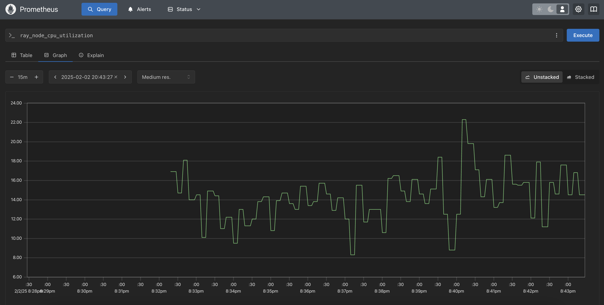
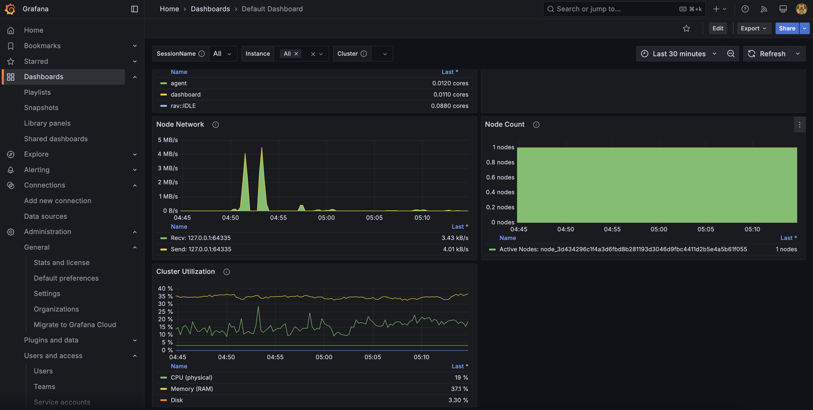

我们在使用类似Stable-Baseline3之类的基于深度学习的强化学习训练框架的时候，
难免需要进行比较多次数的实验和超参搜索。

那么，我们借助Ray Tune这样的框架，可以帮我们来实现对参数的搜索。

本文，即描述了如何通过使用Ray Tune及其框架和组件，来帮助我们实现快速的参数搜索。

<!-- truncate -->

## 安装

由于我们需要使用诸如Ray Dashboard这样的工具。
因此我们需要安装一些附加依赖项（如若不然，我们则无法正常使用类似功能）

```shell
pip install ray[tune,default]
```

## Ray Cluster（Ray集群）

在我们使用Ray的过程中，官方推荐使用诸如云厂商的集群服务，但是为了演示目的。

我们使用如下的本地环境，构建一个本地的集群环境。

```shell
RAY_GRAFANA_HOST=http://localhost:3090 \
RAY_PROMETHEUS_HOST=http://localhost:9090 \
RAY_PROMETHEUS_NAME=Prometheus \
RAY_GRAFANA_IFRAME_HOST=http://localhost:3090 \
ray start --head --port=6379 --dashboard-host=0.0.0.0 --dashboard-port=8000
```

上面的命令是我们启动了一个Head节点（也就是集群的主节点）。
然后，我们启动了Ray Dashboard（8000端口），同时对外暴露了我们的Dashboard服务
（此为演示目的，生产环境请酌情设置）

另外，`ray start`前的环境变量为我们的Metrics嵌入相关的设置，需要完成本文下述的相关的部分后，才可正常显示。

集群启动成功后，我们可以看到如下输出：

```
Local node IP: 127.0.0.1

--------------------
Ray runtime started.
--------------------

Next steps
  
  To connect to this Ray cluster:
    import ray
    ray.init()
  
  To submit a Ray job using the Ray Jobs CLI:
    RAY_ADDRESS='http://127.0.0.1:8000' ray job submit --working-dir . -- python my_script.py
  
  See https://docs.ray.io/en/latest/cluster/running-applications/job-submission/index.html 
  for more information on submitting Ray jobs to the Ray cluster.
  
  To terminate the Ray runtime, run
    ray stop
  
  To view the status of the cluster, use
    ray status
  
  To monitor and debug Ray, view the dashboard at 
    127.0.0.1:8000
  
  If connection to the dashboard fails, check your firewall settings and network configuration.
```

上面的结果，可以看到Dashboard相关的配置输出，这个证明我们的Ray Dashboard的设置是正确的。
我们可以通过浏览器访问上述地址： [http://localhost:8000](http://localhost:8000)。

### 集群状态检查

通过运行`ray status`命令，我们可以查看当前集群的状态。
执行命令后的结果如下：

```
======== Autoscaler status: 2025-02-03 04:21:48.303038 ========
Node status
---------------------------------------------------------------
Active:
 1 node_e3eda3eac5760c03fe761332c030a854809df3ae366ba8e3e852573f
Pending:
 (no pending nodes)
Recent failures:
 (no failures)

Resources
---------------------------------------------------------------
Usage:
 0.0/12.0 CPU
 0B/11.89GiB memory
 0B/2.00GiB object_store_memory

Demands:
 (no resource demands)
```

通过上面的命令，我们可以看到我们当前有一个激活节点（`node_e3eda3eac5760c03fe761332c030a854809df3ae366ba8e3e852573f`）。

因为没有任务启动，因此我们的资源使用情况是空的。

### 集群停止

通过`ray stop`，我们可以来停止集群的运行。

## Ray Dashboard

默认状态下，我们是无法在Dashboard中查看时序序列的指标的。
因此，我们需要通过安装Grafana以及Prometheus来查看相关的时序数据状态。

:::tip 什么是Grafana和Prometheus？

- **Grafana**是一款比较流行的指标展示系统（主要是前端展示），它可以非常快速的接入多种数据来源，并提供展示、告警等指标监控服务。
- **Prometheus**则提供了指标的采集以及查询等服务，可以快速的从不同来源的系统进行指标的采集，以及对外提供指标的查询服务。

:::

### 安装Prometheus

通过执行下述命令，我们可以让Ray帮我们安装Prometheus组件：

```shell
ray metrics launch-prometheus
```

正常安装并运行成功后，我们可以看到如下的输出：

```
Downloaded: 105.84 MB / 105.84 MB
Download completed.
2025-02-03 04:32:09,998 - INFO - Prometheus installed successfully.
2025-02-03 04:32:10,004 - INFO - Prometheus has started.
Prometheus is running with PID 91623.
To stop Prometheus, use the command: `ray metrics shutdown-prometheus`, 'kill 91623', or if you need to force stop, use 'kill -9 91623'.
To list all processes running Prometheus, use the command: 'ps aux | grep prometheus'.
```

我们也可以安装上面的输出，通过运行命令`ps aux | grep prometheus`来查看Prometheus相关的进程，并进行终止等动作。

安装并运行成功后，我们通过浏览器打开地址：[http://localhost:9090](http://localhost:9090)，
即可查看Prometheus的前端。

我们可以通过输入并查询`ray_node_cpu_utilization`等指标，来测试一下Metrics是否正常工作。

正常工作的状态，我们可以看到类似如下的输出：



### 安装Grafana

安装Grafana的方法比较多，我们可以选择通过Grafana官方提供的不同操作系统的安装文件进行安装，也可以选择使用Docker来快速部署我们的Grafana服务。
此处，我们选择使用Docker来部署我们的Grafana服务。

```shell
docker run -d \
  --name=grafana \
  -p 3090:3000 \
  -v grafana-storage:/var/lib/grafana \
  -e "GF_AUTH_ANONYMOUS_ENABLED=true" \
  -e "GF_SECURITY_ALLOW_EMBEDDING=true" \
  grafana/grafana-oss
```

通过上面的命令，我们可以快速安装我们的Grafana服务，并在后台`3090`端口运行我们的服务。

通过浏览器打开：[http://localhost:3090](http://localhost:3090)，我们可以进行Grafana的安装配置等。

:::tip Grafana默认账户密码

Grafana的默认账户和密码都是：`admin`。可以在登陆成功后立即修改密码以保护系统安全。

:::

### 给Grafana添加数据源

登陆成功后，通过：Connections -> Data sources标签，我们添加Prometheus的源地址。
由于我们是通过Docker来启动的Grafana，因此如果要让Container访问我们Host的Prometheus服务，需要使用类似如下的地址：

```
http://host.docker.internal:9090
```

具体的地址，可以根据真实的情况进行更新。

数据源的名称，我们则使用与`RAY_PROMETHEUS_NAME`一样的名称，默认为：`Prometheus`。

### 给Grafana添加Dashboard

在添加数据源后，我们可以通过复制并导入`/tmp/ray/session_latest/metrics/grafana/dashboards` 目录下的4个JSON文件，来快速创建Ray Cluster相关的数据面板。

导入成功后，我们将会看到4个面板：

- Data Dashboard
- Default Dashboard
- Serve Dashboard
- Serve Deployment Dashboard

如Default Dashboard的监控情况：



## 参考资料

- [Collecting and monitoring metrics](https://docs.ray.io/en/latest/cluster/metrics.html) (Ray官方关于安装Prometheus以及Grafana的文档)