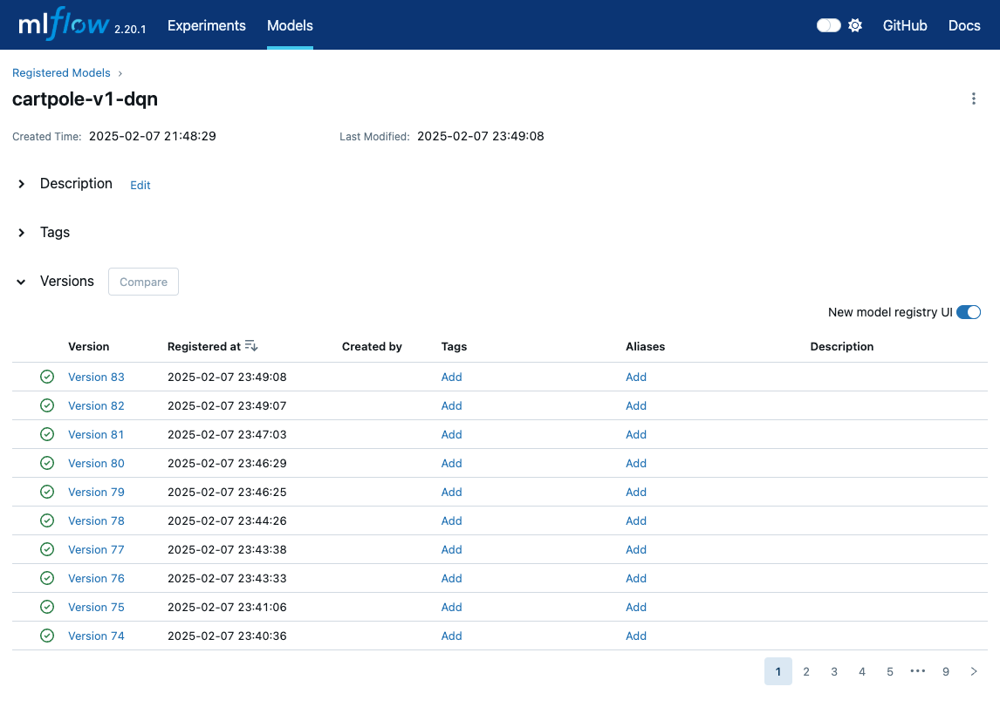
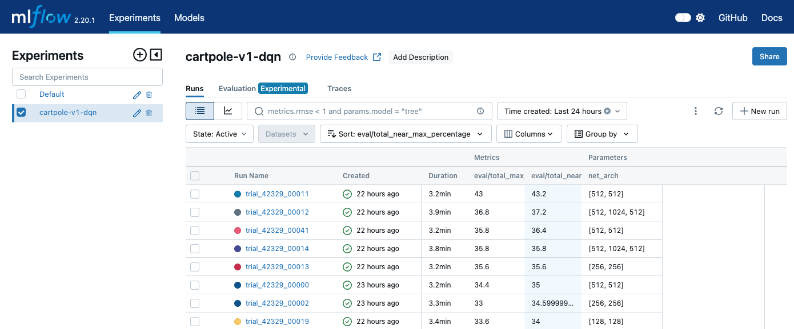
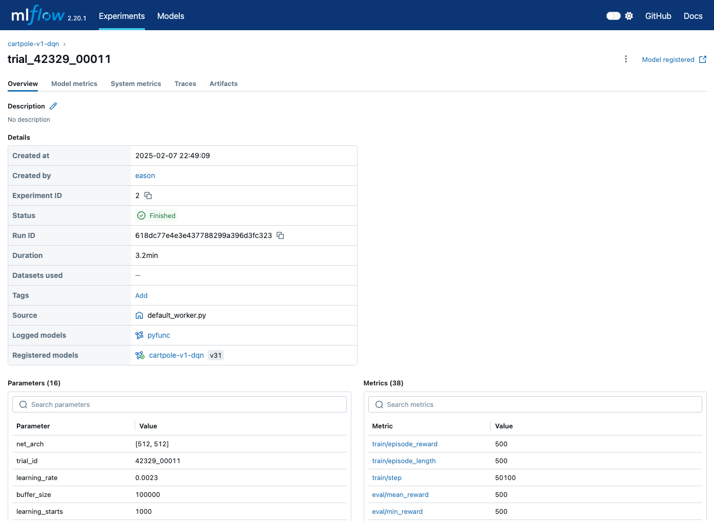
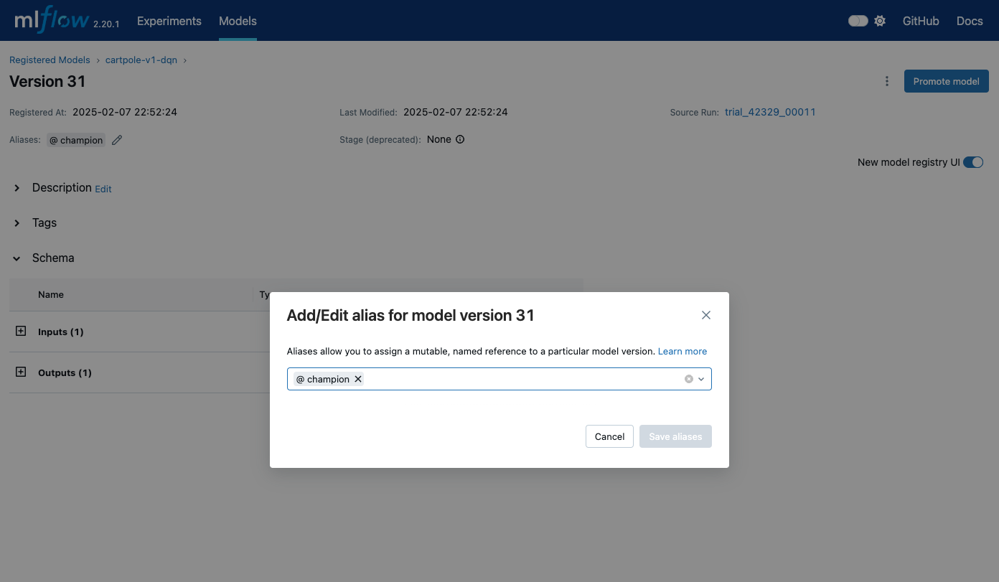

在我们训练结束的时候，往往都会伴随着出来的模型的存放问题。

较为简单的方案就是将模型存放在本地的某一个文件夹下。
但是这样并不利于模型结果的共享。

而MLflow提供了模型的保存功能，可以方便我们及时的将训练好的模型，上传到MLflow中。
以便后续继续深化应用。

<!-- truncate -->

## 问题

MLflow提供了多种的模型保存策略。
也就是说，针对不同框架产生的模型，MLflow提供了多种的方法来便捷的上传不同框架所产生的模型文件。

比如，针对[scikit-learn](https://scikit-learn.org/)，
MLflow提供了`mlflow.sklearn.log_model`这样的方法来快速的提交模型，如代码：

```python
# Log the sklearn model and register
mlflow.sklearn.log_model(
    sk_model=model,
    artifact_path="sklearn-model",
    signature=signature,
    registered_model_name="sk-learn-random-forest-reg-model",
)
```

但是，对于我们的基于Stable-Baselines3，这样的强化学习框架来说，MLflow官方并没有提供相关的框架支持。

不过，MLflow提供了另外一种更为通用的方案，也就是通过`mlflow.pyfunc.log_model`这样的方法来上传模型。
下面，我们就来看看如何使用MLflow来记录Stable-Baselines3训练产生的模型文件。

## 保存模型

在此文中，我们使用了编写类文件来继承`MLflow.pyfunc.PythonModel`这样的方式，来使用相关的能力。

### 新建包装类

首先，针对我们的算法，编写一个新的包装类`MLflowDQNWrapper`，其定义如下：

```python
import numpy as np
from stable_baselines3 import DQN

class MLflowDQNWrapper(mlflow.pyfunc.PythonModel):
    def __init__(self):
        self.model = None
    
    def load_context(self, context):
        # Load the model from the saved path
        self.model = DQN.load(context.artifacts["model_path"])

    def predict(self, context, model_input):
        # Convert model_input to numpy array if it's a pandas DataFrame
        if hasattr(model_input, 'to_numpy'):
            model_input = model_input.to_numpy()
        action, _states = self.model.predict(model_input, deterministic=True)
        return action
```

在上面的定义中：

- `load_context()`：此方法会在模型被加载的时候回调，此处会构造一个DQN的网络，使用存储的模型文件。
- `predict()`：此方法会在模型预测的时候被调用，我们可以看到此处会调用模型本身的`predict`方法来进行预测。

### 上传模型到MLflow

定义好我们的包装类后，我们在单个训练结束后，上传保存我们的模型。
相关代码如下：

```python
# Get the best model path
best_model_path = os.path.join(best_model_save_path, "best_model.zip")

# Create and log the wrapped model
wrapped_model = MLflowDQNWrapper()
input_example = np.array([[0.0, 0.0, 0.0, 0.0]])

# Log the model with MLflow
mlflow.pyfunc.log_model(
    artifact_path="model",
    python_model=wrapped_model,
    artifacts={"model_path": best_model_path},
    signature=mlflow.models.signature.infer_signature(
        model_input=input_example,
        model_output=np.array([0])
    ),
    input_example=input_example,
    registered_model_name="cartpole-v1-dqn"
)
```

我们依次来介绍一下上面的代码的工作：

- `best_model_path`: 首先获取最佳模型的保存路径，这个路径指向了训练过程中保存的最佳模型文件。
- `wrapped_model = MLflowDQNWrapper()`: 创建我们之前定义的包装类的实例，这个包装类将帮助MLflow理解如何加载和使用我们的DQN模型。
- `input_example`: 创建一个示例输入数据，这里使用了一个形状为 (1, 4) 的numpy数组，对应CartPole环境的4个观测值。这个示例输入将帮助MLflow理解模型的输入格式。
- `mlflow.pyfunc.log_model()`: 使用MLflow的通用Python函数接口保存模型，其中：
  - `artifact_path`: 指定模型在MLflow中的存储路径
  - `python_model`: 指定我们的包装类实例
  - `artifacts`: 定义模型相关的文件，这里包含了模型文件的路径
  - `signature`: 通过`infer_signature`推断模型的输入输出签名，帮助MLflow验证数据格式
  - `input_example`: 提供示例输入，帮助其他用户理解如何使用该模型
  - `registered_model_name`: 在Model Registry中注册的模型名称

通过这种方式，我们就可以将Stable-Baselines3训练的DQN模型保存到MLflow中，并且可以方便地进行版本管理和部署。

## 在MLflow中查看模型

### 模型查看

当我们的模型上传成功后，我们可以在MLflow的后台看到我们之前创建的模型，以及相关的记录。

:::tip 创建一个模型还是多个模型？
对于类似多轮的训练来说，我们推荐使用同一个模型名来保存所有版本的模型。

在我们向同一个模型名（例如：`cartpole-v1-dqn`）上传新的版本的时候，新版本会自动编号。
因此我们只要重复向同一个模型上传新版本即可。
:::

我们可以在前端界面中，很轻松的查看到所有的模型版本信息。如下图所示：



### 设置别名

当我们在Experiments模块，看到指标比较好的训练结果后，我们可以通过其关联的注册模型，打开相关的模型详情页面。

比如，我们看到按照我们设定的指标降序，第一个模型效果最好。如下图：


*训练列表页面*

那我们打开相关的训练页面后，可以看到注册模型的连接。如下图：


*训练详情页面*

在点击相关的模型连接后，我们会跳转到对应的模型详情页。
在详情页面，我们单击`Aliases`可以来设置我们想要的别名。
比如在下图中，我们给该模型设置一个名为`champion`的别名，意为冠军（最好的模型）。


*模型详情页页面*

:::tip 别名的设置
一般来说，我们可以给最好的模型设置别名为"冠军"（`champion`），
而给一些潜在比较有价值的模型，待验证的设置"挑战者"(`challenger`)这样的别名。

但，具体名称的设置，可以按照具体的工作要求来进行灵活设置。
:::

别名设置成功后，我们可以在后面的模型下载步骤中，下载对应别名的模型。

## 下载使用模型

针对我们使用的Stable-Baselines3，我们新建一个新的方法来使用我们保存好的模型。

```python
import os
import numpy as np
import mlflow
import gymnasium as gym
from tqdm import tqdm

def evaluate_mlflow():
    # Set up MLflow tracking URI
    mlflow.set_tracking_uri(MLFLOW_TRACKING_URI)

    # Create environment
    env = CartPoleWrapper(gym.make("CartPole-v1", render_mode=None))
    
    # Load the model from MLflow Model Registry using the "Champion" stage
    model_name = "cartpole-v1-dqn"
    alias = "champion"
    loaded_model = mlflow.pyfunc.load_model(f"models:/{model_name}@{alias}")
    
    # Evaluate the model
    n_eval_episodes = 100
    episode_rewards = []
    
    for episode in tqdm(range(n_eval_episodes)):
        obs, _ = env.reset()
        done = False
        episode_reward = 0
        
        while not done:
            # Get prediction from MLflow model
            action = loaded_model.predict(np.array([obs], dtype=np.float64))
            obs, reward, terminated, truncated, _ = env.step(action[0])
            episode_reward += reward
            done = terminated or truncated
            
        episode_rewards.append(episode_reward)
    
    mean_reward = np.mean(episode_rewards)
    std_reward = np.std(episode_rewards)
    
    print(f"Mean reward: {mean_reward:.2f} +/- {std_reward:.2f}")
    print(f"Episode rewards: {episode_rewards}")
    
    return mean_reward, std_reward
```

让我们来详细解释一下这段代码的工作原理：

1. 首先，我们设置MLflow的追踪URI，这样程序就知道从哪里下载模型：

    ```python
    mlflow.set_tracking_uri(MLFLOW_TRACKING_URI)
    ```

2. 创建一个CartPole环境用于评估。这里我们设置`render_mode=None`因为我们只需要进行数值评估：

   ```python
   env = CartPoleWrapper(gym.make("CartPole-v1", render_mode=None))
   ```

3. 从MLflow加载模型。这里我们使用了模型名称和上面创建的别名来指定要加载的具体模型版本：

   ```python
   model_name = "cartpole-v1-dqn"
   alias = "champion"
   loaded_model = mlflow.pyfunc.load_model(f"models:/{model_name}@{alias}")
   ```

   :::tip 多种模型加载模型
   除了使用别名（`alias`）来加载模型外，我们也可以使用模型的版本来加载模型。如：

   ```
   model = mlflow.pyfunc.load_model(model_uri=f"models:/{model_name}/{model_version}")
   ```
   :::

4. 进行模型评估：
   - 设置评估回合数为100次
   - 对于每个回合：
     - 重置环境获取初始观察值
     - 循环直到回合结束（done为True）
     - 使用模型预测动作并执行
     - 累计奖励值
   - 最后计算平均奖励和标准差

这个评估函数可以帮助我们验证从MLflow下载的模型是否能够正常工作，
以及模型的性能如何。

通过运行多个回合并计算平均奖励，我们可以得到一个较为可靠的性能评估结果。

我们上面的模型，在100个回合后，均分都为最高分。
这说明我们之前训练和保存的模型性能都较为理想。

## 总结

在本文中，我们详细介绍了如何使用MLflow来管理和保存强化学习模型，
特别是针对Stable-Baselines3框架训练的模型。
主要内容包括：

1. 通过继承`MLflow.pyfunc.PythonModel`创建自定义包装类，使MLflow能够理解和加载我们的DQN模型。
2. 使用`mlflow.pyfunc.log_model`方法将模型保存到MLflow中。
3. 在MLflow界面中查看和管理模型版本，设置模型别名。
4. 从MLflow中加载模型并进行评估。

这种方式不仅提供了一个统一的模型管理方案，还能够方便地进行模型版本控制和部署。
通过MLflow的模型注册功能，我们可以更好地追踪和管理不同版本的模型，
为模型的迭代优化提供了可靠的基础。

## 参考资料

- [MLflow Model Registry - Registering an Unsupported Machine Learning Model](https://mlflow.org/docs/latest/model-registry.html#registering-an-unsupported-machine-learning-model)
