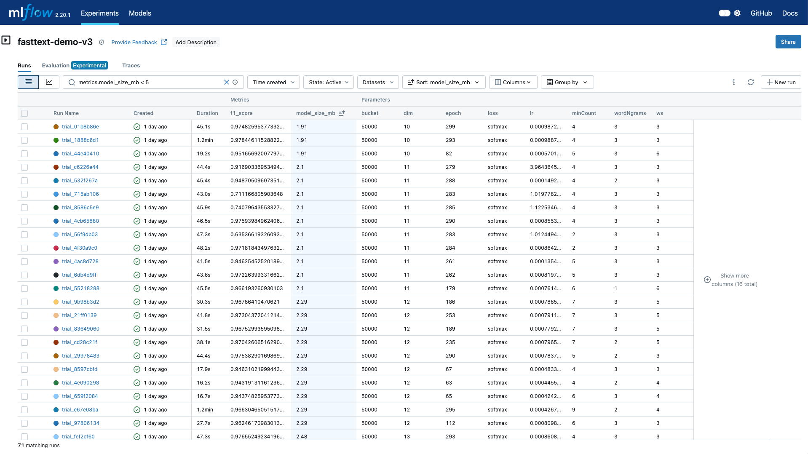

fastText是Facebook研发的一款针对NLP领域的解决方案。

其主要提供了文本分类和词向量学习两大功能。
其核心思想是将整句话的词向量叠加平均作为文本表示，
并使用softmax分类器进行分类。

我们通过本文介绍一下如何使用MLflow以及Ray来训练我们的fastText模型。

<!-- truncate -->

## fastText介绍

fastText作为一个高效的文本分类和词向量表示工具，fastText具有以下特点：

1. **训练速度快**：能够在普通多核CPU上几秒内处理数十亿个词，训练数百万个文本分类器
2. **效果优异**：在文本分类任务中取得与深度学习模型相当的精度
3. **资源占用少**：相比深度学习模型，fastText对硬件要求低，且模型文件小
4. **多语言支持**：支持294种语言的词向量训练

## 训练目标

在本文中，我们会针对[淘宝客服对话数据](https://github.com/cooelf/DeepUtteranceAggregation/)
这个数据集进行处理，我们希望可以训练一个分类器，
来对任意对话文本区分是客户还是客服的消息。

## 数据准备

### 数据文件格式

我们通过上面的网址下载后，可以看到有3个数据文件，分别是 `train.txt`、 `dev.txt`以及`test.txt`。

打开任意的文件，其内部数据如下：

```plaintext
1 在 吗 您好 现在 拍 几天 能 到 辽宁 这个 不 一定 哦 大概 几天 不 知道 么 一般 情况 下 3 到 5 天 左右
0 在 吗 您好 现在 拍 几天 能 到 辽宁 这个 不 一定 哦 大概 几天 不 知道 么 亲 不会 的 呢 您 放心
```

每一行表示为：

- `1`或`0`：正确的对话流程以及错误的对话流程。
- 循环（用`\t`来隔开）：
  - 客户问题
  - 客服回答

比如上面的数据样本的第一行：

```
1 --> 正确的对话
在 吗 --> 客户问题
您好 --> 客服回答
现在 拍 几天 能 到 辽宁 这个 不 一定 哦 大概 几天 不 知道 么 --> 客户问题
一般 情况 下 3 到 5 天 左右 --> 客服回答
```

### fastText要求的数据格式

fastText有自己独立的数据格式，其输入为文本文件，其每一行的数据格式为：

```
分类1 分类2 分类... 文本行
```

即，每一行可以关联多个分类，然后分类信息以及文本行信息以空格隔开。

其分类表示有独特的要求，比如我们希望构建两个分类：

- `seller`：客服
- `customer`：客户

那么其fastText表示为： `__label__customer`和`__label__seller`。

因此，我们需要将上述的原始数据文件，每行进行解析，并按照存储如下的格式的文件，如：

```
__label__customer 您好咱们这边如果能提升您的销量利润您会考虑跟我们合作吗
__label__customer 亲你家什么时候还有活动啊
__label__customer 我的订单怎么两天了没什么变化啊在么
__label__customer 好麻烦你改下谢谢
__label__customer 明天可以发货
__label__seller 有的哦满68送95g猪肉脯一袋
__label__customer 这个买两个有优惠吗
__label__customer 亲亲已下单买这么多请掌柜的多送点小礼物啊
__label__customer 嗯嗯了解了哦
__label__customer 我买10个付款的时候怎么不打折呢
__label__seller 您这边提交订单看看哦系统自动改价的和芒果干一样的
__label__seller 不好意思亲可能快递途中挤压造成的这边退亲2元差价亲看可以吗
__label__customer 亲有原味瓜子么
```

### 处理代码

我们可以构建下面的两个函数，来读取原始的数据文件，然后逐行按照上面的格式，构建一个包含了客户和客服的数据文件。
并按照fastText的格式，保存成训练或者验证文件。

```python
def load_data(path):
    with open(path, 'r') as f:
        data = f.readlines()

    customer_utterances = []
    seller_utterances = []

    for idx, line in tqdm(enumerate(data)):
        utterances = line.strip().split('\t')
        utterances = [re.sub(r'[\s\n\t]', '', utterance) for utterance in utterances]

        if utterances[0] == '1':
            customer_utterances += utterances[1::2]
            seller_utterances += utterances[2::2]

    # Remove utterances only contain digits. If it contains digits and other characters, keep it.
    customer_utterances = [utterance for utterance in customer_utterances if not re.match(r'^[0-9]+$', utterance)]
    seller_utterances = [utterance for utterance in seller_utterances if not re.match(r'^[0-9]+$', utterance)]

    # Only keep utterances with more than 5 characters
    customer_utterances = [utterance for utterance in customer_utterances if len(utterance) > 5]
    seller_utterances = [utterance for utterance in seller_utterances if len(utterance) > 5]

    # If the utterance are the same in both customer and seller, remove duplicates using sets
    customer_set = set(customer_utterances)
    seller_set = set(seller_utterances)
    
    # Remove duplicates that appear in both sets
    unique_customer = list(customer_set - seller_set)
    unique_seller = list(seller_set - customer_set)
    
    return unique_customer, unique_seller

def generate_fasttext_data(customer_utterances, seller_utterances, output_path):
    """Generate FastText training data with labels."""
    with open(output_path, 'w', encoding='utf-8') as f:
        # Write customer utterances
        for utterance in customer_utterances:
            f.write(f"__label__customer {utterance}\n")
        
        # Write seller utterances
        for utterance in seller_utterances:
            f.write(f"__label__seller {utterance}\n")
    
    print(f"FastText training data saved to {output_path}")
    print(f"Total samples: {len(customer_utterances) + len(seller_utterances)}")
    print(f"Customer samples: {len(customer_utterances)}")
    print(f"Seller samples: {len(seller_utterances)}")
```

文件处理后，共有训练数据238,275条，其中客户对话138,429条，客服对话99,846条。

## 训练

### fastText训练

我们可以通过`fasttext.train_supervised()`函数来训练我们的模型。比如，使用如下的内容进行训练：

```python
model = fasttext.train_supervised(
    input=input_path, 
    epoch=100, 
    lr=0.1, 
    wordNgrams=2, 
    verbose=2
)
model.save_model(output_path)
```

其中`input_path`就是我们上面整理好的数据文件。其他的参数，我们可以选择通过Ray Tune来帮我们进行寻找。

### Ray Tune寻找参数

为了使用Ray Tune，我们需要定义一个训练的步骤，其接收训练的超参数配置，通过制定训练文件，以及测试文件。
代码如下：

```python
def get_file_size_mb(file_path):
    """
    Get file size in megabytes.
    
    Args:
        file_path (str): Path to the file
        
    Returns:
        float: File size in MB
    """
    size_bytes = os.path.getsize(file_path)
    size_mb = size_bytes / (1024 * 1024)
    return round(size_mb, 2)

def train_and_evaluate_model(config, input_path, test_path):
    mlflow.set_tracking_uri(MLFLOW_TRACKING_URI)
    mlflow.set_experiment("fasttext-demo-v3")

    context = ray.train.get_context()
    trial_id = context.get_trial_id()

    with mlflow.start_run(run_name=f'trial_{trial_id}') as run:
        model_path = f'model_trail_{trial_id}.bin'

        training_df = convert_file_into_dataframe(input_path=input_path)
        dataset = mlflow.data.from_pandas(
            training_df, name='traing data', targets='label'
        )
        mlflow.log_input(dataset=dataset, context='training')

        mlflow.log_params(config)

        # Use the dictionary's attributes in the function call
        model = fasttext.train_supervised(**config)

        model.save_model(model_path)

        model_size_mb = get_file_size_mb(model_path)

        num_of_samples, precision, recall = model.test(test_path)
        f1_score = 2 * precision * recall / (precision + recall)

        mlflow.log_metrics({
            "f1_score": f1_score,
            "precision": precision,
            "recall": recall,
            "model_size": model.get_output_matrix().size,
            "model_size_mb": model_size_mb,
        })

        tune.report({
            "f1_score": f1_score,
            "precision": precision,
            "recall": recall,
            "model_size": model.get_output_matrix().size,
            "model_size_mb": model_size_mb,
            "model_path": model_path,
        })
```

函数`train_and_evaluate_model`是我们用来训练和评估fastText模型的核心函数，它结合了MLflow和Ray Tune的功能。详细解析如下：

1. **函数参数**：
   - `config`：包含模型训练参数的字典
   - `input_path`：训练数据文件的路径
   - `test_path`：测试数据文件的路径

2. **MLflow设置**：

   ```python
   mlflow.set_tracking_uri(MLFLOW_TRACKING_URI)
   mlflow.set_experiment("fasttext-demo-v3")
   ```

   设置MLflow的追踪服务器地址并创建名为`fasttext-demo-v3`的实验。

3. **Ray Tune上下文**：

   ```python
   context = ray.train.get_context()
   trial_id = context.get_trial_id()
   ```

   获取Ray Tune的训练上下文和试验ID，用于区分不同的训练试验。其格式为8位16进制的字符串，例如：`01b8b86e`。

4. **数据准备**：

   ```python
   training_df = convert_file_into_dataframe(input_path=input_path)
   dataset = mlflow.data.from_pandas(training_df, name='traing data', targets='label')
   mlflow.log_input(dataset=dataset, context='training')
   ```

   将训练数据转换为DataFrame，并创建MLflow数据集对象。
   此步骤非必须，主要是为了演示如何使用MLflow的`mlflow.log_input`来保存训练的数据。

5. **模型训练**：

   ```python
   model = fasttext.train_supervised(**config)
   model.save_model(model_path)
   ```

   使用配置参数训练fastText模型，并保存模型文件。

6. **模型评估**：

   ```python
   model_size_mb = get_file_size_mb(model_path)

   num_of_samples, precision, recall = model.test(test_path)
   f1_score = 2 * precision * recall / (precision + recall)
   ```

   使用测试数据评估模型性能，计算精确率、召回率和F1分数。
   同时我们也通过函数`get_file_size_mb`来计算生成模型文件的大小，
   主要是考虑既满足模型的准确率等要求，同时，也要比较小的计算性能消耗。

7. **指标记录**：
   - 使用MLflow记录参数和指标：

     ```python
     mlflow.log_params(config)
     mlflow.log_metrics({...})
     ```

   - 向Ray Tune报告结果：

     ```python
     tune.report({...})
     ```

   记录训练参数、评估指标和模型大小等信息。

函数`train_and_evaluate_model`通过MLflow追踪每次训练的过程和结果，同时通过Ray Tune进行超参数优化。每次训练都会：

- 记录训练参数
- 保存训练数据信息
- 训练模型
- 评估模型性能
- 记录各种指标

这样我们就可以通过MLflow的UI界面查看每次训练的详细信息，并通过Ray Tune找到最优的模型参数配置。

:::tip 训练文件路径

我们在使用Ray Tune进行训练的时候，需要注意Ray是一个分布式的训练引擎，
因此它有可能会在不同的主机上运行训练代码。

所以，我们需要确保训练的数据，在不同的主机上都可以被访问。

本文中，我们使用的是本地单机的Ray，所以我们使用了绝对路径来提供训练文件，如：
`/ray-tune/data/fasttext_train.txt`。

:::

### 定义参数寻找范围

我们有了上面的训练函数后，就可以通过定义Ray的参数范围，以及优化策略来训练我们的模型了。

```python
def tune_fasttext_parameters(input_path, test_path, num_samples=50):
    ray.init()

    config = {
        "input": input_path,
        "epoch": tune.randint(50, 300),
        "lr": tune.loguniform(1e-5, 1e-3),  # Reduced max learning rate
        "wordNgrams": tune.randint(1, 4),
        "dim": tune.randint(10, 50),
        "ws": tune.randint(3, 7),
        "minCount": tune.randint(2, 10),
        "minn": 1,
        "maxn": 3,
        "bucket": tune.choice([50000, 100000, 200000]),
        "thread": 4,
        "loss": "softmax",
        "verbose": 2,
    }

    search_algo = OptunaSearch(
        metric=["f1_score", "model_size_mb"],
        mode=["max", "min"],
    )

    analysis = tune.run(
        lambda trail_config: train_and_evaluate_model(trail_config, input_path, test_path),
        config=config,
        num_samples=num_samples,
        search_alg=search_algo,
        resources_per_trial={"cpu": 4}
    )

    # Get the best trial based on both metrics
    best_trial = analysis.get_best_trial(
        metric="f1_score",  # Primary metric
        mode="max",
        scope="last"  # Consider only the last reported results
    )
    print(f"Best trial: {best_trial}")

    return best_trial
```

函数`tune_fasttext_parameters`是用来配置和执行Ray Tune超参数优化的主要函数。其详细设置如下：

1. **函数参数**：
   - `input_path`：训练数据文件的路径
   - `test_path`：测试数据文件的路径
   - `num_samples`：超参数搜索的试验次数，默认为50次

2. **Ray初始化**：

   ```python
   ray.init()
   ```

   初始化Ray运行时环境，为分布式训练做准备。

3. **超参数配置空间**：

   ```python
   config = {
       "input": input_path,
       "epoch": tune.randint(50, 300),
       "lr": tune.loguniform(1e-5, 1e-3),
       "wordNgrams": tune.randint(1, 4),
       ...
   }
   ```

   定义了fastText模型的各个超参数的搜索空间：

   - `epoch`：训练轮数，在50到300之间随机选择。
   - `lr`：学习率，在1e-5到1e-3之间按对数均匀分布选择。
   - `wordNgrams`：词组长度，在1到4之间选择。
   - `dim`：词向量维度，在10到50之间选择。
   - `ws`：上下文窗口大小，在3到7之间选择。
   - `minCount`：最小词频，在2到10之间选择。
   - `bucket`：哈希桶数量，在[50000, 100000, 200000]中选择，其数值较小可减少模型大小，但是容易产生冲突并损失特征信息。

4. **搜索算法配置**：

   ```python
   search_algo = OptunaSearch(
       metric=["f1_score", "model_size_mb"],
       mode=["max", "min"],
   )
   ```

   使用Optuna作为搜索算法，优化两个目标：
   - 最大化F1分数
   - 最小化模型大小

5. **执行超参数搜索**：

   ```python
   analysis = tune.run(
       lambda trail_config: train_and_evaluate_model(trail_config, input_path, test_path),
       config=config,
       num_samples=num_samples,
       search_alg=search_algo,
       resources_per_trial={"cpu": 4}
   )
   ```

   启动超参数搜索：
   - 每次试验都会调用`train_and_evaluate_model`函数
   - 使用配置的参数空间进行搜索
   - 执行指定次数的试验
   - 每个试验分配4个CPU核心

6. **获取最佳结果**：

   ```python
   best_trial = analysis.get_best_trial(
       metric="f1_score",
       mode="max",
       scope="last"
   )
   ```

   从所有试验中选择最佳结果：
   - 主要基于F1分数进行选择
   - 选择F1分数最高的试验
   - 只考虑每个试验的最后一次结果

这个函数通过Ray Tune的超参数优化功能，自动搜索最佳的fastText模型参数配置。它不仅考虑了模型的性能（F1分数），
还考虑了模型的大小，这样可以在性能和资源消耗之间找到一个良好的平衡点。

:::tip 多目标优化
在本例中，我们使用了Optuna作为搜索算法，并设置了两个优化目标：F1分数和模型大小。
这种多目标优化可以帮助我们在模型性能和资源消耗之间找到更好的平衡。

但是在最终选择最佳试验时，我们仍然主要基于F1分数进行选择。这是因为在实际应用中，
我们通常会优先考虑模型的性能，只要模型大小在可接受的范围内即可。
:::

## 可选步骤

### 对训练异常进行处理

由于fastText在训练过程中，可能会报错。因此我们可以针对训练过程中的异常进行捕获，然后进行针对性的处理。

```python
def train_and_evaluate_model(config, input_path, test_path):
    # ...
        try:
            # Use the dictionary's attributes in the function call
            model = fasttext.train_supervised(**config)

            model.save_model(model_path)

            model_size_mb = get_file_size_mb(model_path)

            num_of_samples, precision, recall = model.test(test_path)
            f1_score = 2 * precision * recall / (precision + recall)

            mlflow.log_metrics({
                "f1_score": f1_score,
                "precision": precision,
                "recall": recall,
                "model_size": model.get_output_matrix().size,
                "model_size_mb": model_size_mb,
            })

            tune.report({
                "f1_score": f1_score,
                "precision": precision,
                "recall": recall,
                "model_size": model.get_output_matrix().size,
                "model_size_mb": model_size_mb,
                "model_path": model_path,
            })
        except Exception as e:
            print(f"Error: {e}")
            mlflow.log_param('error_message', str(e))
            mlflow.log_metric('failed', 1)

            tune.report({
                "f1_score": -1,
                "precision": -1,
                "recall": -1,
                "model_size": -1,
                "model_size_mb": sys.float_info.max,
                "model_path": model_path,
            })
    # ...
```

从上面的代码中，我们添加了`try...except`语句来处理异常，尤其是在异常后，
我们会记录异常的原因，同时利用`tune.report`来告知优化器，该参数组合可能会造成异常。
因此，应当尽量规避。

### 记录模型

在训练并验证后，我们希望可以保存模型的模型文件，因此通过构造支持`mlflow.pyfunc.log_model`的包装器，
我们可以快捷的保存并注册模型文件。例如我们构造的包装器：

```python
class FastTextWrapper(mlflow.pyfunc.PythonModel):
    def load_context(self, context):
        self.model = fasttext.load_model(context.artifacts["fasttext_model"])
    
    def predict(self, context, model_input):
        predictions = []
        for text in model_input["text"]:
            label, prob = self.model.predict(text)
            predictions.append({"label": label[0], "probability": prob[0]})
        return predictions
```

在模型训练后，我们可以及时注册模型文件，如下：

```python
# Log the model as an artifact
mlflow.log_artifact(model_path, "model")

mlflow.pyfunc.log_model(
    artifact_path="fasttext_model",
    python_model=FastTextWrapper(),
    artifacts={
        "fasttext_model": model_path
    },
    registered_model_name="fasttext_classifier"
)
```

这样，在我们的MLflow系统中，我们就可以查看到某一个运行结果所对应的模型文件信息了。

而且，也方便我们后续使用响应的模型结果用于验证等目的。

## 结果解析

我们打开MLflow的后台，通过检索过滤满足：`metrics.model_size_mb < 5`条件的记录，我们得到71个运行结果。如下图所示：



我们按照`model_size_mb`进行排序，可以找到最小模型大小的文件，然后我们通过检查`f1_score`的结果，可以获得相应的训练参数。

## 总结

在本文中，我们通过使用Ray Tune以及MLflow，实现了针对fastText的训练。

同时借助参数寻找优化策略，我们可以快速的找到让我们满意的参数空间。
