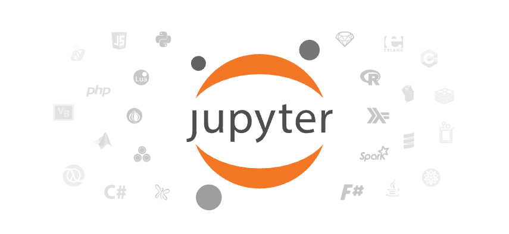
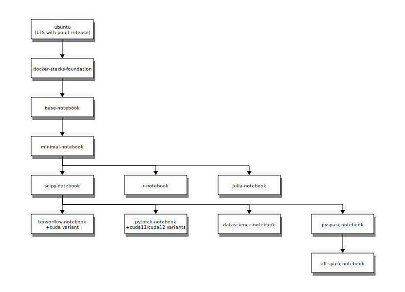
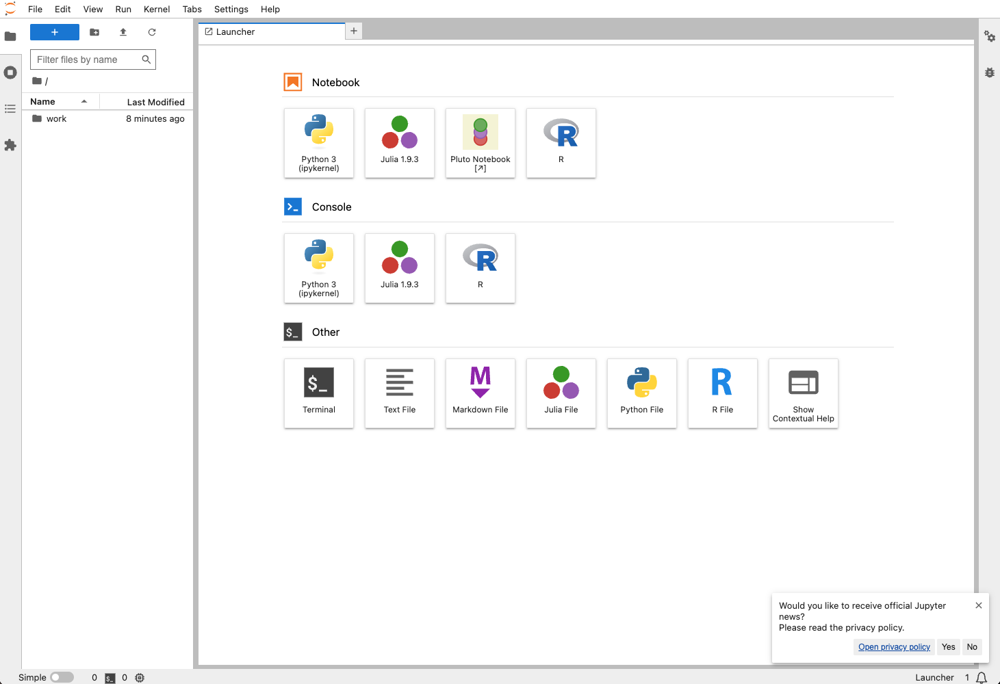

在我们进行机器学习开发的过车中，我们可能需要一些实验环境。
比如已经预制安装好Python环境，以及常用的Python包，比如sklearn, seaborn等工具。

为了将隔绝不同的开发环境，我们本文中使用Docker来构建相关的环境，
以便进行机器学习的开发工作。

<!-- truncate -->

## 背景介绍

在日常的机器学习开发过程中，比较简单的方案是通过下载安装[Anaconda](https://www.anaconda.com/)，
并通过`conda`命令来管理不同的环境。


或者是通过Python的[venv](https://docs.python.org/3/library/venv.html)等工具，
来构建一个相对独立的环境。

虽然这些设置有一定的隔离性，但是还是不够彻底。

因此，本文我们会介绍一个基于Docker的方案。来构建机器学习工程师所必要的开发环境。

我们的目标用户主要是那些使用传统机器学习算法来解决比较简单的机器学习任务的工程师。
针对深度学习的相关开发环境，我们也会简单介绍一下。

## Jupyter

对于一个机器学习工程师来说，使用最多的开发环境，
肯定是[Jupyter](https://jupyter.org/)环境，
尤其是[Jupyter Lab](https://github.com/jupyterlab)
这样的互动开发环境。



Jupyter项目组，针对Docker的部署方式，专门有一个独立项目来介绍相关的Docker镜像：
[Jupyter Docker Stacks](https://jupyter-docker-stacks.readthedocs.io/)

在该项目中，有多个镜像可供选择，我们通过如下的图来详细解释下：



为了最大化我们的便利程度，我们可以有目的的选择基于`scipy-notebook`的镜像，即：

- `datascience-notebook`：其包含了`scipy-notebook`以及针对R和Julia语言的支持。
- `tensorflow-notebook`：其包含了`scipy-notebook`以及针对[Tensorflow](https://www.tensorflow.org/)的支持。
- `pytorch-notebook`：其包含了`scipy-notebook`以及针对[PyTorch](https://pytorch.org/)的支持。
- `pyspark-notebook`：其包含了`scipy-notebook`以及针对
  [PySpark](https://spark.apache.org/docs/latest/api/python/index.html)的支持。

由于我们在本文中的目标是针对比较大众的机器学习任务进行开发，因此我们会选择`datascience-notebook`这个版本的镜像进行介绍。

## Docker运行

我们在本节会介绍如何使用Docker来运行相关的代码，但是在运行前，我们需要梳理一下我们期望的要求：

1. 首先要打通容器内的文件和宿主机文件的映射关系，也就是我们需要挂载宿主机的文件夹到容器内。
   这样方便我们保留操作过的数据，不至于容器关闭后，数据丢失。
2. 我们需要通过端口可以访问到Jupyter Lab的网页界面，也就是我们希望进行端口映射，将容器内的端口，映射到宿主机上。
3. 我们希望在容器内以管理员权限启动容器，这样在容器中，方便我们以管理员（root）权限安装或修改配置等。
4. 我们希望在容器中安装的额外Python包文件，在重启容器后，依然予以保存。

我们可以通过如下的启动命令，来启动相关的容器来满足我们上述的要求：

```shell
# Create volume before using it
docker volume create jupyter-data

# Run docker container
docker run -d \
    --name jupyter-ds \
    -p 28888:8888 \
    -v "$HOME/_jupyter_mount":/home/jovyan/work \
    -v jupyter-data:/home/jovyan/.local \
    --user root \
    -e GRANT_SUDO=yes \
    -e CHOWN_HOME=yes \
    -e CHOWN_HOME_OPTS='-R' \
    jupyter/datascience-notebook
```

让我们来解释一下这个命令的各个参数：

- `-d`: 以后台模式运行容器
- `--name jupyter-ds`: 给容器指定一个名称，方便后续管理
- `-p 28888:8888`: 将容器内的 8888 端口映射到主机的 28888 端口
- `-v "$HOME/_jupyter_mount":/home/jovyan/work`: 将用户目录下的`_jupyter_mount`目录挂载到容器内的工作目录
- `-v jupyter-data:/home/jovyan/.local`: 创建一个命名卷来持久化存储用户安装的包
- `--user root`: 以 root 用户运行容器
- `-e GRANT_SUDO=yes`: 允许使用 sudo 命令
- `-e CHOWN_HOME=yes`: 在容器启动时自动修改 home 目录的所有权
- `-e CHOWN_HOME_OPTS='-R'`: 递归修改所有子目录和文件的所有权，确保完整的权限设置
- `jupyter/datascience-notebook`: 使用的镜像名称

启动容器后，可以通过以下命令查看 Jupyter Lab 的访问链接（以及访问密码）：

```shell
docker logs jupyter-ds
```

现在我们可以打开本地的服务地址：[http://localhost:28888](http://localhost:28888)来访问我们的Jupyter Lab服务。
登陆成功后，我们可以看到界面：



## 包管理

在使用过程中，我们可能需要安装一些额外的Python包。由于我们使用了数据卷来保存`.local`目录，
所以安装的包会被持久化保存。以下是安装包的几种方式：

1. 通过Jupyter Lab的终端安装：

    ```shell
    pip install --user package_name
    ```

2. 通过容器外部安装：

    ```shell
    docker exec -it jupyter-ds pip install --user package_name
    ```

3. 通过requirements.txt批量安装：

    ```shell
    # 首先创建requirements.txt文件
    echo "pandas==2.0.0
    scikit-learn==1.2.0
    matplotlib==3.7.0" > requirements.txt

    # 将文件复制到容器内
    docker cp requirements.txt jupyter-ds:/tmp/

    # 在容器内安装
    docker exec -it jupyter-ds pip install --user -r /tmp/requirements.txt
    ```

注意：使用`--user`参数可以确保包被安装到用户目录下，这样可以避免权限问题，
并且由于我们挂载了数据卷，这些包会被持久化保存。

## 容器管理

在日常使用过程中，我们可能需要对容器进行一些管理操作，以下是一些常用的命令：

```shell
# 停止容器
docker stop jupyter-ds

# 启动已存在的容器
docker start jupyter-ds

# 重启容器
docker restart jupyter-ds

# 删除容器（需要先停止容器）
docker rm jupyter-ds

# 查看容器日志
docker logs jupyter-ds

# 进入容器内部执行命令
docker exec -it jupyter-ds bash
```

这些命令可以帮助你更好地管理你的Jupyter环境。特别是当你需要安装新的包或者调试环境问题时，
使用`docker exec`命令进入容器内部会非常有用。

## 总结

在本文中，我们介绍了Jupyter的多个Docker镜像版本，
以及如何使用Docker来快速构建一个机器学习的开发环境。

需要注意的是，在不同版本的镜像中，可能存在版本不兼容的现象。
比如需要使用Tensorflow的专有功能，还是需要使用相应的镜像版本。

在使用这个环境时，有一些安全注意事项：

1. 虽然我们使用了root权限启动容器，但在日常使用中应该尽量避免使用root权限操作。
2. 建议修改默认的Jupyter登录密码，可以通过设置环境变量`JUPYTER_TOKEN`来实现。
3. 如果在生产环境使用，建议配置HTTPS，并限制访问IP。
4. 定期更新Docker镜像以获取安全补丁。
