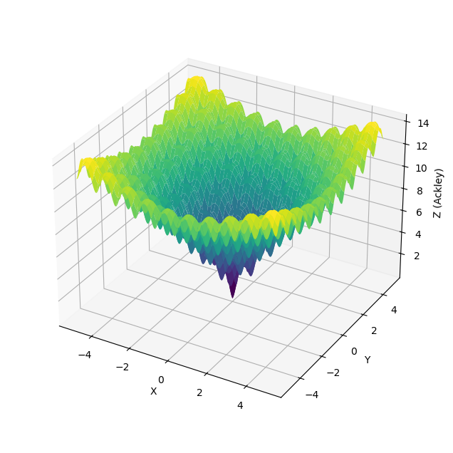
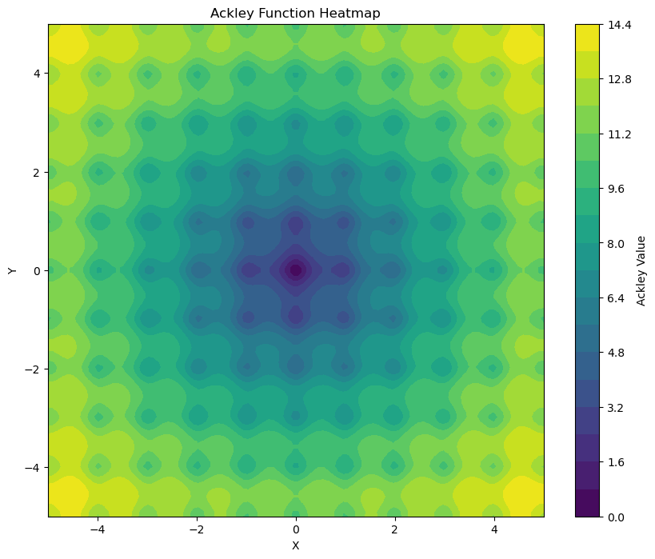

在使用Optuna的过程中，我们需要设置超参数的采样策略。
而不同的采样策略应该会带来不同的表现，
因而影响最终的结果。

在本文中，我们通过可视化的过程，来展现不同的Optuna
采样器在Ackley函数上的表现。

<!-- truncate -->

## 验证问题的选择

和网上常看到的对比案例一样，我们希望需要选择一个2D的优化问题。
主要是为了直观的可以在2D平面上渲染出来最终的效果。

因此，我们把筛选的目标框定在2D，也就是有两个参数的验证问题上。

参考论文[优化算法测试函数综述及应用分析](https://pdf.hanspub.org/csa20211100000_20612334.pdf)
中的描述，我们选用[Ackley函数](https://en.wikipedia.org/wiki/Ackley_function)
作为我们的验证问题。

其函数公式为：

$$

f(x) = -a \exp \left( -b \sqrt{\frac{1}{d} \sum_{i=1}^d x_i^2} \right) - \exp \left( \frac{1}{d} \sum_{i=1}^d \cos(c x_i) \right) + a + \exp(1)

$$

其函数图案如下所示：



我们可以看到，该函数有一个全局最优解（在正中间的位置），
而在全剧最优解的周围，有很多的局部最优解。

我们通过其2D的轮廓线图案，可以更容易的看出来：



对应上面的数学公式，其函数的Python表示如下：

```python
import numpy as np

def ackley_2d(x, y, a=20, b=0.2, c=2*np.pi):
    return -a * np.exp(-b * np.sqrt(0.5 * (x**2 + y**2))) \
        - np.exp(0.5 * (np.cos(c*x) + np.cos(c*y))) \
        + a \
        + np.exp(1)
```

## Optuna采样器

Optuna自带了多种采样器，从比较经典的随机采样、网格搜索采样，到进阶的的算法：

1. **随机采样器 (RandomSampler)**

    - 这是最基本的采样器，它从每个超参数的定义域中随机选择值。
    - 适用于搜索空间较小或对优化效率要求不高的场景。但是其解的最优程序，具有随机性。

2. **网格采样器 (GridSampler)**

    - 网格采样器通过在预定义的网格上评估所有可能的超参数组合来进行工作。
    - 当搜索空间较小且您希望彻底探索所有组合时，此方法非常有用。
    - 但当超参数的数量增加时，网格搜索会迅速变得不切实际。

3. **TPE 采样器 (TPESampler)**

    - TPE（Tree-structured Parzen Estimator）采样器是一种基于贝叶斯优化的采样器。
    - 它通过构建两个概率密度估计器（一个用于表现好的试验，一个用于表现差的试验）来工作。
    - TPE 采样器是 Optuna 的默认采样器。

4. **CmaEsSampler**

    - CMA-ES（Covariance Matrix Adaptation Evolution Strategy）采样器是一种进化算法。
    - 它通过维护一个候选解的分布，并随着时间的推移对其进行改进来工作。
    - CMA-ES 采样器在处理高维和非凸优化问题时非常有效。

5. 更多采样器

    Optuna 还提供了其他采样器，例如：

    - PartialFixedSampler：用于固定部分超参数的采样器。
    - ……

### 采样器对比表

下表是从[Optuna Github项目代码](https://github.com/optuna/optuna/blob/release-v4.2.1/docs/source/reference/samplers/index.rst)
转换而来，可以方便我们快速对比相关采样的特性。

|                                  | RandomSampler                 | GridSampler                   | TPESampler                    | CmaEsSampler                  | NSGAIISampler                                               | QMCSampler                    | GPSampler                     | BoTorchSampler                | BruteForceSampler                                             |
|----------------------------------|-------------------------------|-------------------------------|-------------------------------|-------------------------------|-------------------------------------------------------------|-------------------------------|-------------------------------|-------------------------------|-------------------------------------------------------------|
| 浮点参数（Float parameters）                 | ✅                             | ✅                             | ✅                             | ✅                             | 🔺                                                          | ✅                             | ✅                             | ✅                             | ✅ (❌ for infinite domain)                                     |
| 整型参数（Integer parameters）               | ✅                             | ✅                             | ✅                             | ✅                             | 🔺                                                          | ✅                             | ✅                             | 🔺                             | ✅                                                          |
| 分类参数（Categorical parameters）           | ✅                             | ✅                             | ✅                             | 🔺                             | ✅                                                          | 🔺                             | ✅                             | 🔺                             | ✅                                                          |
| Pruning（剪枝）                          | ✅                             | ✅                             | ✅                             | 🔺                             | ❌ (🔺 for single-objective)                                   | ✅                             | 🔺                             | 🔺                             | ✅                                                          |
| 多参数优化（Multivariate optimization）        | 🔺                             | 🔺                             | ✅                             | ✅                             | 🔺                                                          | 🔺                             | ✅                             | ✅                             | 🔺                                                          |
| 条件搜索空间（Conditional search space）         | ✅                             | 🔺                             | ✅                             | 🔺                             | 🔺                                                          | 🔺                             | 🔺                             | 🔺                             | ✅                                                          |
| 多目标优化（Multi-objective optimization）     | ✅                             | ✅                             | ✅                             | ❌                             | ✅ (🔺 for single-objective)                                   | ✅                             | ❌                             | ✅                             | ✅                                                          |
| 批量优化（Batch optimization）               | ✅                             | ✅                             | ✅                             | ✅                             | ✅                                                          | ✅                             | 🔺                             | ✅                             | ✅                                                          |
| 分布式优化（Distributed optimization）         | ✅                             | ✅                             | ✅                             | ✅                             | ✅                                                          | ✅                             | 🔺                             | ✅                             | ✅                                                          |
| 约束优化（Constrained optimization）         | ❌                             | ❌                             | ✅                             | ❌                             | ✅                                                          | ❌                             | ❌                             | ✅                             | ❌                                                          |
| 时间复杂度（Time complexity） (per trial) (*) | $O(d)$                          | $O(dn)$                         | $O(dn log n)$                   | $O(d^3)$                        | $O(mp^2)$ (***)                                               | $O(dn)$                         | $O(n^3)$                        | $O(n^3)$                        | $O(d)$                                                        |
| 建议运行次数（Recommended budgets） (#trials) (**) | as many as one likes          | number of combinations        | 100 – 1000                    | 1000 – 10000                  | 100 – 10000                                                 | as many as one likes          | – 500                         | 10 – 100                      | number of combinations                                        |

注释：

- ✅：支持；🔺：支持，但不高效；❌：不支持

下面，我们通过视频来讲解一下各个采集器。

### 随机采样器 (RandomSampler)

Python声明：

```python
"RandomSampler": optuna.samplers.RandomSampler(),
```

我们从下面的演示视频能看到，随机采样器由于其随机性，
无法很好的在10x10的范围内找到中央的最优解。

也就是其采样的随机性，让其无法在较大的范围内，在有限的回合内找到近似最优解。

<video width="640" height="auto" autoplay loop muted controls>
  <source src="/videos/optuna-sampler/optuna_search_RandomSampler_winter_autumn.mp4" type="video/mp4" />
  Your browser does not support the video tag.
</video>

### 网格采样器 (GridSampler)

Python声明：

```python
"GridSampler": optuna.samplers.GridSampler(search_space={
    "x": np.linspace(-5, 5, 10).tolist(), 
    "y": np.linspace(-5, 5, 10).tolist()
}),
```

网格采样器，跟我们预期的一样，是根据我们设置的网格形状，进行逐一寻找。

:::tip GridSampler的采样顺序

但是，我们看到，它的搜索顺序，并不是按照某一个固定的规律，
比如从左到右或者从上到下这样的顺序。而是一种随机的策略。

这个也很好理解，毕竟Optuna这样的超参数框架，是依赖于并行计算等方式来进行搜寻，
因此即使是网格搜索这样的采样器，它也是随机顺序对可能的采样空间进行采样。
:::

<video width="640" height="auto" autoplay loop muted controls>
  <source src="/videos/optuna-sampler/optuna_search_GridSampler_winter_autumn.mp4" type="video/mp4" />
  Your browser does not support the video tag.
</video>

### TPE 采样器 (TPESampler)

Python声明：

```python
"TPESampler": optuna.samplers.TPESampler(),
```

我们可以看到，TPE采样对比随机采样和网格采样，
其在后期的采样过程中，逐渐收敛到了中间全局最优的周围，
但是仍然有部份震荡的行为。

<video width="640" height="auto" autoplay loop muted controls>
  <source src="/videos/optuna-sampler/optuna_search_TPESampler_winter_autumn.mp4" type="video/mp4" />
  Your browser does not support the video tag.
</video>

因此，我们考虑将100个采样步数，调整为1000看看其是否会逐渐向全局最优靠拢。

<video width="640" height="auto" autoplay loop muted controls>
  <source src="/videos/optuna-sampler/optuna_search_TPESampler_1000_winter_autumn.mp4" type="video/mp4" />
  Your browser does not support the video tag.
</video>

我们可以看到，即使我们延长采样的步骤，我们依然可以在后期的采样行为中，
观察到很多非中心的采样行为发生。

同时，我们注意到，在全局最优解的x轴和y轴方向，
出现了一个十字形的采样模式。
这个模式也很好的验证了TPE采样器的算法模式，
即针对每一个超参数，其构建了两个概率模型。

因此，我们才能看到在X轴上出现了Y轴的最优解的高概率分布。

## 其他

Optuna团队也提出了AutoSampler的概念，其可以根据参数的搜索空间，
以及验证次数来自动选择适合的采样器。

详细描述在文章：[AutoSampler: Automatic Selection of Optimization Algorithms in Optuna](https://medium.com/optuna/autosampler-automatic-selection-of-optimization-algorithms-in-optuna-1443875fd8f9)

## 参考资料

- [优化算法测试函数综述及应用分析](https://pdf.hanspub.org/csa20211100000_20612334.pdf)
