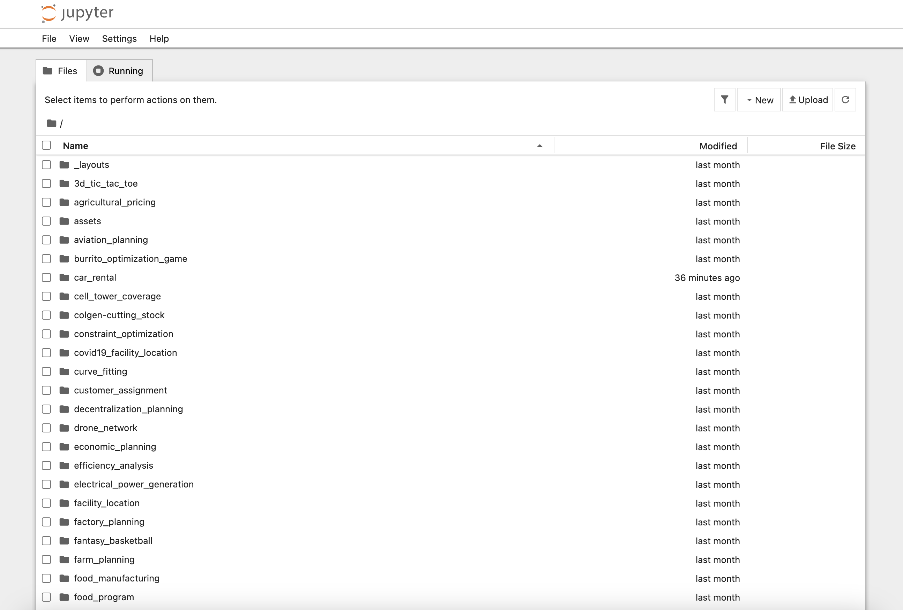
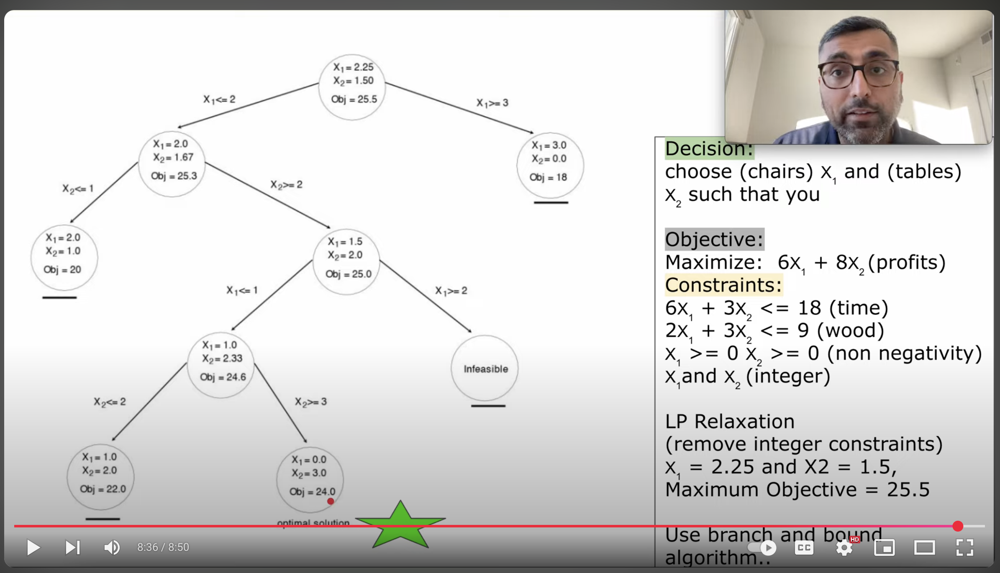

本文介绍了如何熟悉Gurobi，并展开学习。

<!-- truncate -->

## 安装

### 通过Docker使用Gurobi

我们可以运行如下命令启动基于Docker的Python JupyterLab的运行环境。
该环境默认提供了多种的Python Notebook案例，我们可以择取来学习Gurobi。

```bash
docker run -p 10888:8888 gurobi/modeling-examples
```

运行命令后，我们打开：
[http://localhost:10888/lab](http://localhost:10888/lab)来查看JupyterLab环境。
如下图所示：



我们打开任意一个文件夹，即可开始进行Gurobi的案例研究。

## 二进制整数规划

### 分支定界算法

首先对问题进行定义，然后通过线性规划松弛（Linear Programming Relaxation）来获得小数解（作为初始的上界或者下界）。
松弛的含义就是暂时去掉结果必须是整数的限制，先通过小数来求一个在当前可行域内的全局最优小数解，作为后续分支的参考界限。

然后，通过分支将问题拆解为多个子问题，针对某个变量的取值添加整数约束，从而缩小解空间，探索可能的整数解。
依次遍历部分子问题，并通过剪枝（Pruning），提前终止那些目标函数值比当前已知界更差的分支，以减少计算量。
通过不断更新上界和下界，逐步收敛，直到找到全局最优的整数解，或者所有分支都被探索或剪枝，算法终止。


*[Branch and bound algorithm example](https://youtu.be/cEcS13Ku1i8?t=516)*


## 参考资料

- Gurobi官方入门指南: [https://support.gurobi.com/hc/en-us/articles/14799677517585-Getting-Started-with-Gurobi-Optimizer](https://support.gurobi.com/hc/en-us/articles/14799677517585-Getting-Started-with-Gurobi-Optimizer)
- Branch and bound algorithm example: [https://www.youtube.com/watch?v=cEcS13Ku1i8](https://www.youtube.com/watch?v=cEcS13Ku1i8)
